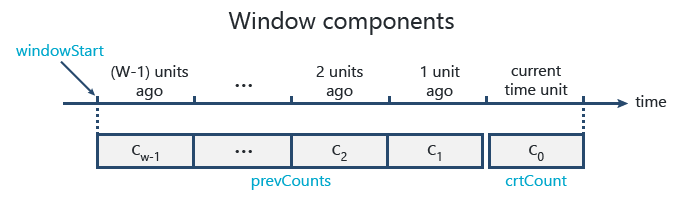
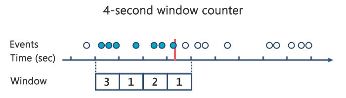

## hops

hops is a hopping window counter that keeps track of how many events happened in the last N time units, with a hop size of 1 time unit. It's also safe to use concurrently by multiple readers and writers.

### Use case
The main problem that it solves and the reason I've built it is to count a large number of events over a period of time, while using a constant amount of memory regardless of how many events occur.

This counter implementation is right for you if the sentences below apply to your use case:
- You want to keep track of how many events happened in the last N time units (e.g. last 5 minutes).
- You want to count a large number of events (thousands, hundreds of thousands, millions etc.).
- You care only about the number of events. The details of each event are irrelevant to you.

As a sidenote, a simple integer variable that is incremented for each event is not enough to solve this problem. Old events must be expired once they are outside of the time window of interest. Since the integer variable has no idea of the timestamps when it was incremented, it doesn't know by what amount to decrement itself after each unit of time passes. Therefore, by itself, an integer variable is unable to keep track of a moving count.

### How to get
```
go get github.com/ocpodariu/hops
```

### Example - Basic usage
```
package main

import (
    "fmt"
    "time"

    "github.com/ocpodariu/hops"
)

func main() {
	// Create a counter to track events from last 5 minutes
	c := hops.NewCounter(5, time.Minute)

	// Register events as they appear
	c.Observe()
	c.Observe()
	c.Observe()

	// Check number of registered events
	fmt.Println(c.Value())
}
```

### Example - Count HTTP requests
Keep track of how many requests you've handled in the last 5 seconds.

```
package main

import (
	"fmt"
	"log"
	"math/rand"
	"net/http"
	"time"

	"github.com/ocpodariu/hops"
)

func main() {
	c := hops.NewCounter(5, time.Second)

	http.HandleFunc("/hop", func(w http.ResponseWriter, r *http.Request) {
		c.Observe()

		// Do some work
		time.Sleep(time.Duration(rand.Intn(50)) * time.Millisecond)

		fmt.Fprint(w, c.Value())
	})

	log.Fatal(http.ListenAndServe(":8080", nil))
}
```

### How it works
Let W be the window size.

hops uses a counter for each time unit within the window (e.g., a 5-minute window uses 5 counters, one for each minute). Since only the current time unit counter is updated it is stored in a separate variable, `crtCount`, while the counters for the past (W-1) time units are stored in the `prevCounts` slice. The total number of events within the window is calculated as the sum of all counters from the slice plus the current time unit counter.

Here is a visual overview of the window components as they relate to time:



As time passes and new events are observed, old ones are removed from the window. After each time unit that passes, the window hops one time unit forward and the counters are updated:
1. The oldest counter, c<sub>w-1</sub>, is removed by shifting the values in `prevCounts` one position to the left.
2. The current unit counter, c<sub>0</sub>, is copied into `prevCounts` on the rightmost position (c<sub>1</sub>).
3. c<sub>0</sub> is reset to 0.

The window hops are made through the `refreshWindow()` function. This is called before every `Observe()` and `Value()` operation to make sure the window contains only events from the past W time units.

This animation shows how a 4-second window counter is updated in real-time as events are observed:


